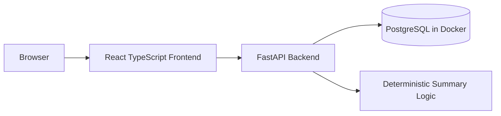

# Ascertain Healthcare Dashboard

A full-stack patient management dashboard for a medical practice, built with React TypeScript, FastAPI, and PostgreSQL.

## Quick Start

Prerequisite: Docker Desktop or another Docker daemon must be running.

```bash
docker compose up --build
```

Open:

```text
Frontend: http://localhost:5173
Backend:  http://localhost:8000
Docs:     http://localhost:8000/docs
Health:   http://localhost:8000/health
```

The backend creates tables on startup and seeds 120 synthetic patients when the database is empty.

## Local Development

Backend:

```bash
cd backend
python -m venv .venv
source .venv/bin/activate
pip install -r requirements.txt
uvicorn app.main:app --reload
```

Frontend:

```bash
cd frontend
npm install
npm run dev
```

By default, local backend tests use SQLite at `backend/dev.db`; Docker uses PostgreSQL through `DATABASE_URL`.

## Verification

```bash
cd backend
source .venv/bin/activate 2>/dev/null || true
python -m pytest -q
python -m compileall -q app tests
```

```bash
cd frontend
npm run lint
npm run build
```

```bash
docker compose config
docker compose up --build
```

## API Surface

Required endpoints are implemented:

```text
GET    /health
GET    /patients
GET    /patients/{id}
POST   /patients
PUT    /patients/{id}
DELETE /patients/{id}
POST   /patients/{id}/notes
GET    /patients/{id}/notes
DELETE /patients/{id}/notes/{note_id}
GET    /patients/{id}/summary
```

`GET /patients` supports backend-owned `page`, `page_size`, `search`, `status`, `sort_by`, and `sort_dir`.

## Architecture



Key tradeoffs:

* Backend-owned pagination/filtering/sorting keeps list behavior scalable and testable.
* Deterministic summaries avoid API keys, latency, nondeterminism, and fake LLM plumbing.
* TanStack Query is used for server state instead of heavier client state management.
* No auth, roles, queues, websockets, or external APIs were added because they are outside the take-home scope.

See `docs/ARCHITECTURE_TIMELINE.md` for the commit-by-commit implementation narrative.
