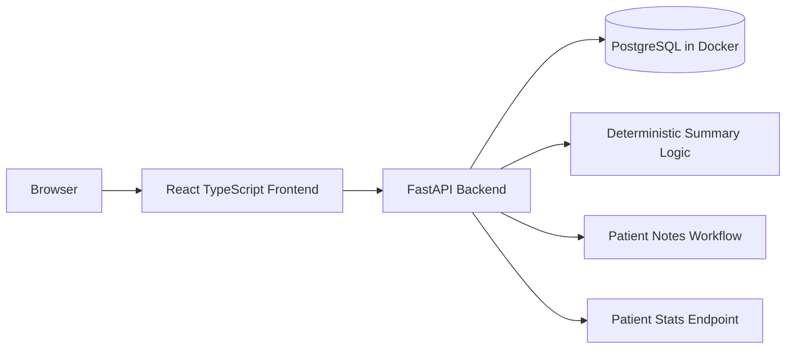

# Ascertain Healthcare Dashboard

A full-stack patient management dashboard for a medical practice, built with React TypeScript, FastAPI, and PostgreSQL.

The app includes patient CRUD, backend-owned search/filter/sort/pagination, patient notes, deterministic patient summaries, operational status metrics, request logging, and Docker-based local setup.

## Quick Start

Prerequisite: Docker Desktop or another Docker daemon must be running.

```bash
docker compose up --build
```

Open:

```text
Frontend: http://localhost:5173
Backend:  http://localhost:8000
Docs:     http://localhost:8000/docs
Health:   http://localhost:8000/health
```

The backend creates tables on startup and seeds 120 synthetic patients when the database is empty.

## Reviewer Path

1. Start the app with `docker compose up --build`.
2. Open `http://localhost:5173`.
3. View the patient operational dashboard.
4. Search, filter by status, sort, and paginate through patients.
5. Open a patient detail page.
6. Add a clinical note.
7. View the generated patient summary.
8. Create a new patient.
9. Edit patient status, allergies, conditions, date of birth, and last visit date.
10. Confirm API docs at `http://localhost:8000/docs`.

## Verification

For full pre-submission verification:

```bash
make preflight
```

This runs backend tests, frontend lint/build, Docker Compose validation, container startup, API smoke tests, frontend response checks, and a forbidden tracked-file check.

For local setup without Docker:

```bash
cd backend
python3 -m venv .venv
source .venv/bin/activate
pip install -r requirements.txt
python -m uvicorn app.main:app --reload
```

In a second terminal:

```bash
cd frontend
npm install
npm run dev
```

By default, local backend development uses SQLite at `backend/dev.db`. Docker uses PostgreSQL through `DATABASE_URL`.

## API Surface

Required endpoints are implemented:

```text
GET    /health

GET    /patients
GET    /patients/{id}
POST   /patients
PUT    /patients/{id}
DELETE /patients/{id}

POST   /patients/{id}/notes
GET    /patients/{id}/notes
DELETE /patients/{id}/notes/{note_id}

GET    /patients/{id}/summary
GET    /patients/stats
```

`GET /patients` supports backend-owned:

```text
page
page_size
search
status
sort_by
sort_dir
```

Example:

```bash
curl "http://localhost:8000/patients?page=1&page_size=10&search=smith&status=active&sort_by=name&sort_dir=asc"
```

## Architecture



## Frontend Decisions

* Vite + React TypeScript keeps the frontend fast and simple.
* React Router handles navigation.
* TanStack Query handles server state: loading, errors, caching, refetching, and mutations.
* Local React state is used for UI state such as filters and form values.
* Redux was intentionally avoided because the application state is primarily server state.

## Backend Decisions

* FastAPI provides typed request/response handling and automatic API docs.
* SQLAlchemy models define the database layer.
* Pydantic schemas validate API payloads.
* The backend owns pagination, filtering, sorting, and validation.
* Request logging is metadata-only: method, path, status code, and duration. Patient bodies, notes, and clinical details are not logged.

## Patient Summary Design

The generated patient summary is deterministic rather than LLM-backed.

This keeps the project locally runnable without external credentials, network dependencies, latency, nondeterminism, or hallucination risk. The summary is derived from structured patient fields and recent notes.

## Data

All seeded data is synthetic.

The app seeds 120 patients so pagination, search, filtering, sorting, and the status dashboard can be exercised against more than a tiny sample dataset.

No real patient data should be used with this project.

## Validation and Error Handling

The app validates patient input on both the frontend and backend.

Examples:

* future date of birth is rejected
* required fields are enforced
* invalid email is rejected
* invalid status and blood type values are rejected
* patient not found returns `404`
* invalid payloads return validation errors
* patient list sorting is constrained to known safe fields
* network and validation errors are surfaced in the UI

## Stretch Goals Implemented

* Backend sorting/filtering query parameters
* Request logging middleware
* Patient status metrics and visualization
* API endpoint tests
* One-command preflight verification

## Tradeoffs

* Backend-owned pagination/filtering/sorting keeps list behavior scalable and testable.
* Deterministic summaries avoid API keys, latency, nondeterminism, and fake LLM plumbing.
* No auth, roles, queues, websockets, or external APIs were added because they are outside the take-home scope.
* Startup table creation is used instead of Alembic migrations to keep the project easy to run in a time-boxed take-home. In production, I would use explicit migrations.
* The app prioritizes correctness, maintainability, and easy local setup over visual complexity.

## Future Improvements

Given more time, I would add:

* authentication and role-based access control
* audit trail for patient edits and note changes
* Alembic migrations
* CI workflow for backend tests and frontend build
* E2E tests for core user journeys
* deeper accessibility review
* production deployment configuration

## Architecture Timeline

See `docs/ARCHITECTURE_TIMELINE.md` for the commit-by-commit implementation narrative and diagrams.
