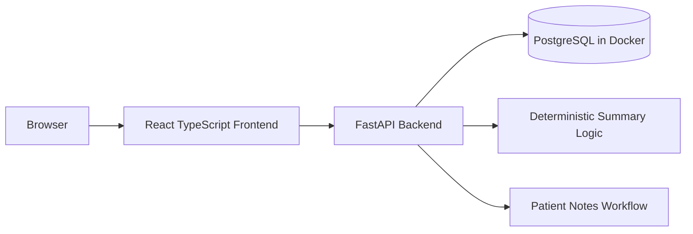

# Ascertain Healthcare Dashboard

A full-stack patient management dashboard for a medical practice, built with React TypeScript, FastAPI, and PostgreSQL.

The app supports patient CRUD, backend-owned search/filter/sort/pagination, operational patient metrics, patient notes, generated patient summaries, responsive routing, metadata-only request logging, and Docker-based local setup.

## Quick Start

Prerequisite: Docker Desktop or another Docker daemon must be running.

```bash
docker compose up --build
```

Open:

```text
Frontend: http://localhost:5173
Backend:  http://localhost:8000
Docs:     http://localhost:8000/docs
Health:   http://localhost:8000/health
```

The backend creates tables on startup and seeds 120 synthetic patients when the database is empty.

## Suggested Reviewer Path

1. Start the app with `docker compose up --build`.
2. Open the patient directory at `http://localhost:5173/patients`.
3. Review operational metrics and the patient status breakdown.
4. Search, filter by status, sort, and paginate.
5. Open a patient detail page.
6. Add a patient note.
7. View the generated patient summary.
8. Create a new patient.
9. Edit the patient, including status, allergies, conditions, date of birth, and last visit date.
10. Confirm API docs at `http://localhost:8000/docs`.

## Local Development

Backend:

```bash
cd backend
python -m venv .venv
source .venv/bin/activate
pip install -r requirements.txt
python -m uvicorn app.main:app --reload
```

Frontend, in a second terminal:

```bash
cd frontend
npm install
npm run dev
```

By default, local backend development uses SQLite at `backend/dev.db`. Docker uses PostgreSQL through `DATABASE_URL`.

## Verification

The repo includes a root-level `Makefile` for common checks.

Before running `make verify`, create/install the backend virtual environment and frontend dependencies once:

```bash
cd backend
python -m venv .venv
source .venv/bin/activate
pip install -r requirements.txt
cd ..

cd frontend
npm install
cd ..
```

Then run:

```bash
make verify
```

Equivalent manual commands:

```bash
cd backend
source .venv/bin/activate
python -m pytest -q
python -m compileall -q app tests
cd ..
```

```bash
cd frontend
npm run lint
npm run build
cd ..
```

```bash
docker compose config
```

To fully verify the containerized app:

```bash
docker compose down -v --remove-orphans
docker compose up --build
```

Then check:

```bash
curl http://localhost:8000/health
curl "http://localhost:8000/patients?page=1&page_size=5"
curl http://localhost:8000/patients/stats
```

## API Surface

Required endpoints are implemented:

```text
GET    /health
GET    /patients
GET    /patients/stats
GET    /patients/{id}
POST   /patients
PUT    /patients/{id}
DELETE /patients/{id}

POST   /patients/{id}/notes
GET    /patients/{id}/notes
DELETE /patients/{id}/notes/{note_id}

GET    /patients/{id}/summary
```

`GET /patients` supports backend-owned:

```text
page
page_size
search
status
sort_by
sort_dir
```

Example:

```bash
curl "http://localhost:8000/patients?page=1&page_size=10&search=smith&status=active&sort_by=last_name&sort_dir=asc"
```

## Architecture



## Frontend Decisions

* Vite + React TypeScript keeps the frontend fast and simple.
* React Router handles route-level navigation.
* TanStack Query handles server state: loading, errors, caching, refetching, and mutations.
* Local React state is used only for UI concerns like form inputs and filters.
* Redux was intentionally avoided because the application state is primarily server state.

## Backend Decisions

* FastAPI provides typed request/response handling and automatic API docs.
* SQLAlchemy models define the database layer.
* Pydantic schemas validate incoming and outgoing API data.
* The backend owns pagination, filtering, sorting, and validation.
* Request logging uses standard Python logging and records only method, path, status code, and duration. Request bodies and patient data are intentionally not logged.
* Local development can use SQLite, while Docker uses PostgreSQL.

## Patient Summary Design

The generated patient summary is deterministic rather than LLM-backed.

This was intentional because the take-home should run locally without external credentials, network dependencies, latency, nondeterminism, or hallucination risk. The summary is derived from structured patient fields and recent notes.

## Validation and Error Handling

The app validates patient input on both the frontend and backend.

Examples:

* future date of birth is rejected
* required fields are enforced
* invalid email is rejected
* patient not found returns `404`
* invalid payloads return validation errors
* patient list sorting is constrained to known safe fields

## Data

All seeded data is synthetic.

The app seeds 120 patients so pagination, search, filtering, and sorting can be exercised against more than a tiny sample dataset.

No real patient data should be used with this project.

## Tradeoffs

* Backend-owned pagination/filtering/sorting keeps list behavior scalable and testable.
* Operational metrics use a lightweight backend stats endpoint instead of deriving global counts from one paginated frontend response.
* Deterministic summaries avoid API keys, latency, nondeterminism, and fake LLM plumbing.
* TanStack Query is used for server state instead of heavier client state management.
* No auth, roles, queues, websockets, or external APIs were added because they are outside the take-home scope.
* The app prioritizes correctness, maintainability, and easy local setup over visual complexity.

## Future Improvements

Given more time, I would add:

* role-based authentication
* audit trail for patient edits and note changes
* richer dashboard analytics
* E2E tests for core user flows
* Alembic migrations instead of startup table creation
* CI workflow for backend tests and frontend build
* more advanced accessibility review
* production deployment configuration

## Architecture Timeline

See `docs/ARCHITECTURE_TIMELINE.md` for the commit-by-commit implementation narrative and diagrams.
