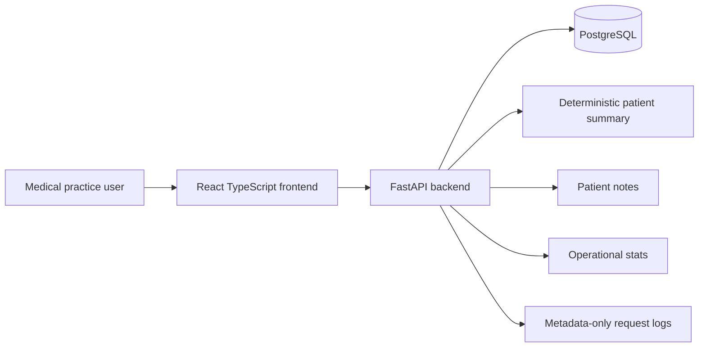
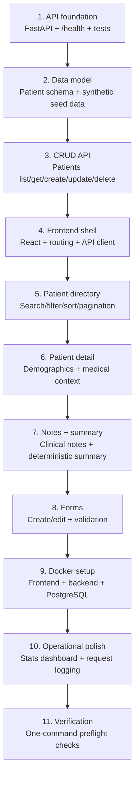
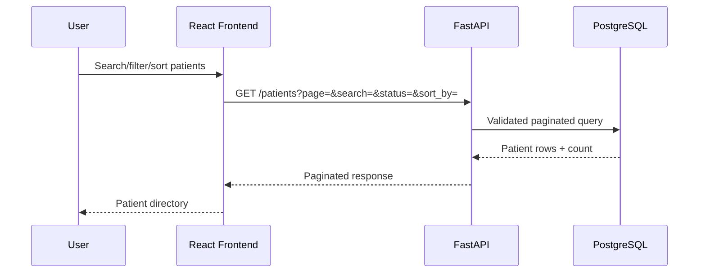
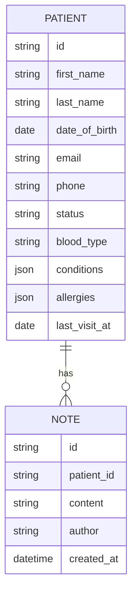

# Architecture Timeline

A high-level visual summary of how the Ascertain Healthcare Dashboard evolved from backend foundation to a complete full-stack patient workflow.

## Final System



## Build Timeline



## Request Flow



## Data Model



## Milestone Summary

| Phase               | What changed                                                    | Why it mattered                                                                     |
| ------------------- | --------------------------------------------------------------- | ----------------------------------------------------------------------------------- |
| API foundation      | Added FastAPI app, settings, `/health`, backend tests           | Established a runnable/testable backend entrypoint                                  |
| Data model          | Added patient schema and synthetic seed data                    | Created realistic records for list, forms, and dashboard workflows                  |
| Patient CRUD        | Added list/get/create/update/delete endpoints                   | Covered the core backend requirements                                               |
| Frontend foundation | Added React TypeScript app, routing, API client, layout         | Created the browser-facing dashboard shell                                          |
| Patient directory   | Added search, status filter, sorting, pagination                | Made the list usable with 100+ patients and kept list logic backend-owned           |
| Patient detail      | Added patient profile view                                      | Let users inspect demographics, contact info, conditions, allergies, and status     |
| Notes and summary   | Added patient notes and deterministic summaries                 | Modeled a practical clinical workflow without requiring external LLM APIs           |
| Forms               | Added create/edit flows with validation                         | Completed the main patient management loop                                          |
| Docker              | Added Compose setup for frontend, backend, and PostgreSQL       | Made reviewer setup reproducible with one command                                   |
| Operational polish  | Added status metrics, status visualization, and request logging | Turned the patient list into an operational dashboard and added basic observability |
| Preflight           | Added one-command verification script                           | Reduced reviewer and developer setup risk                                           |

## Current Backend Surface

```text
GET    /health

GET    /patients
GET    /patients/{id}
POST   /patients
PUT    /patients/{id}
DELETE /patients/{id}

GET    /patients/stats

GET    /patients/{id}/notes
POST   /patients/{id}/notes
DELETE /patients/{id}/notes/{note_id}

GET    /patients/{id}/summary
```

## Key Design Decisions

### Backend-owned list behavior

Search, filtering, sorting, and pagination live in the backend instead of filtering a full dataset in the browser. This keeps the frontend responsive and makes the API boundary more realistic as the patient list grows.

### Deterministic summary

The patient summary is deterministic rather than LLM-backed. This keeps the project locally runnable, testable, and free from API keys, latency, nondeterminism, and hallucination risk.

### Server-state management

The frontend uses TanStack Query for server state: fetching, caching, loading states, error states, and mutation invalidation. Local React state is reserved for UI controls and form inputs.

### Metadata-only request logging

The backend logs method, path, status code, and request duration. It intentionally does not log patient payloads, notes, allergies, conditions, DOB, address, or other patient details.

### Docker-first reviewer setup

The primary reviewer path is `docker compose up --build`. Local development remains available, but Docker is the source of truth for the full stack.

## Verification

Final verification is handled through:

```bash
make preflight
```

This checks:

* forbidden tracked files
* backend tests
* backend compile
* frontend lint
* frontend build
* Docker Compose config
* Docker rebuild/start
* backend health
* patient API smoke tests
* notes and summary smoke tests
* frontend response

## Remaining Production Improvements

These were intentionally left out of scope for a time-boxed take-home:

* authentication and role-based access control
* explicit Alembic migrations
* audit trail for patient edits
* CI workflow
* E2E browser tests
* production deployment configuration
* deeper accessibility pass
