# ARCHITECTURE_TIMELINE.md

# Architecture Timeline

This document explains how the Ascertain healthcare dashboard evolved commit by commit. It is intended to be useful both for code review and for explaining the project in a follow-up engineering interview.

## Purpose

This project is a full-stack patient management dashboard for a medical practice. It is built with:

* React TypeScript frontend
* FastAPI backend
* PostgreSQL database through Docker Compose
* synthetic patient data
* deterministic patient summaries
* patient notes workflow

The project is built incrementally so each commit represents a working milestone.

## Current Architecture Snapshot

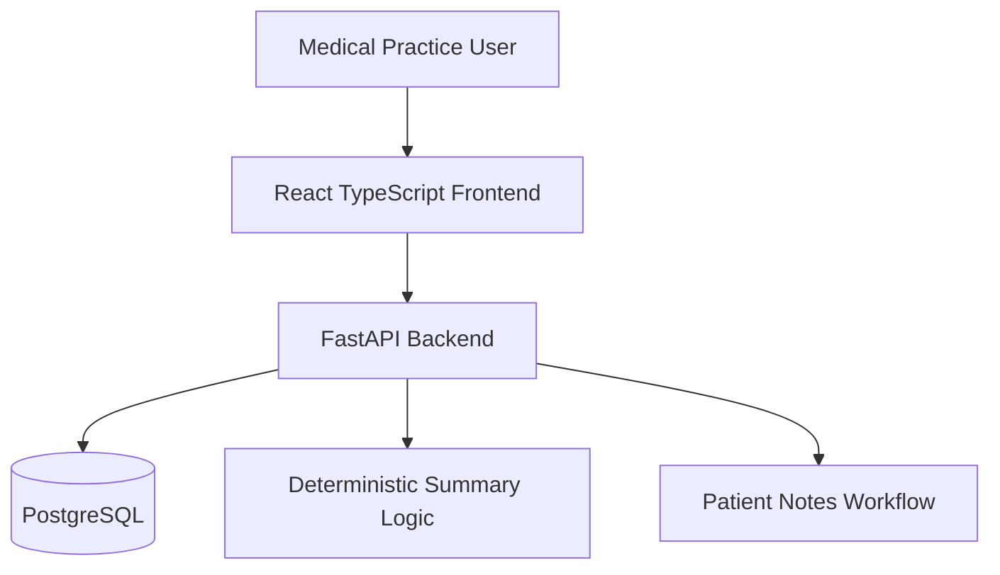

## Commit Timeline

### 1. FastAPI foundation

**Commit:** `feat(api): add FastAPI foundation, health check, settings, and tests`

**What changed**

* Added FastAPI application structure.
* Added app settings.
* Added `GET /health`.
* Added a backend health test.

**Why it mattered**

* Established the backend entrypoint.
* Verified the API can run and be tested.
* Satisfied the required health-check endpoint.

**Requirement coverage**

* FastAPI backend initialized.
* `GET /health` returns `{"status": "ok"}`.

**Verification**

* `pytest -q`

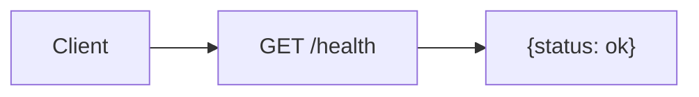

---

### 2. Patient database model and seed data

**Commit:** `feat(api): add patient database model and seed data`

**What changed**

* Added SQLAlchemy database setup.
* Added patient model.
* Added synthetic seed data.
* Added database seed tests.

**Why it mattered**

* Created the data foundation for the dashboard.
* Made the app capable of storing realistic patient records.
* Prepared the project for PostgreSQL in Docker.

**Requirement coverage**

* Patient schema.
* Realistic sample data.
* Re-creatable database foundation.

**Verification**

* `pytest -q`

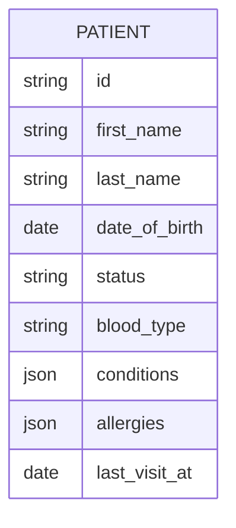

---

### 3. Patient CRUD API

**Commit:** `feat(api): implement patient CRUD endpoints`

**What changed**

* Added Pydantic schemas for patient create, update, read, and paginated list responses.
* Added `/patients` CRUD routes backed by SQLAlchemy sessions.
* Added backend-owned pagination, search, status filtering, and sorting.
* Added API tests for list behavior, validation errors, not-found responses, and create/read/update/delete.

**Why it mattered**

* Established the main API contract the React app will consume.
* Kept scalable list behavior on the backend instead of forcing the browser to load every patient.
* Made server validation and error responses explicit before frontend forms depend on them.

**Requirement coverage**

* `GET /patients`
* `GET /patients/{id}`
* `POST /patients`
* `PUT /patients/{id}`
* `DELETE /patients/{id}`
* Appropriate status codes for create, delete, validation, and missing records.
* Backend tests for important patient API behavior.

**Verification**

* `cd backend`
* `source .venv/bin/activate 2>/dev/null || true`
* `python -m pytest -q`
* `python -m compileall -q app tests`

**Current architecture impact**

The backend now exposes a reviewer-facing patient API over the seeded database. The frontend can depend on paginated `items`, `total`, `page`, `page_size`, and `pages` metadata instead of inventing client-only list behavior.

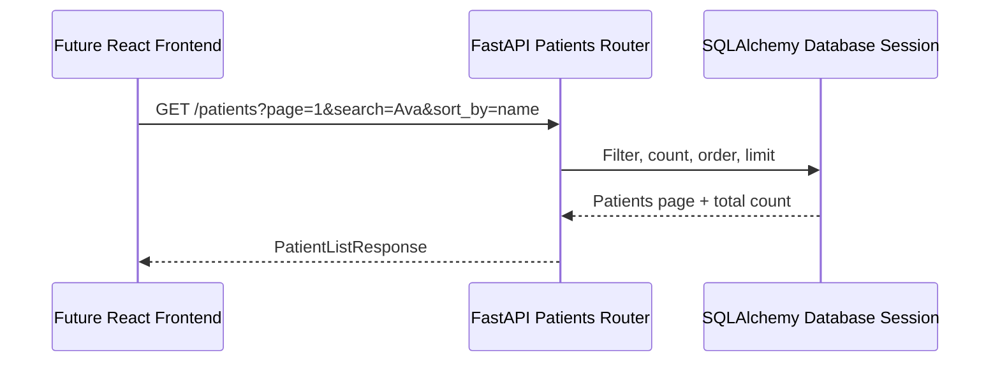

---

### 4. React routing and API client foundation

**Commit:** `feat(web): initialize React app with routing and API client`

**What changed**

* Added a Vite React TypeScript frontend in `frontend/`.
* Added route placeholders for `/`, `/patients`, `/patients/:id`, `/patients/new`, `/patients/:id/edit`, and `*`.
* Added a typed API client for patient list, read, create, update, and delete calls.
* Added TanStack Query provider setup for server-state flows that will be built in later milestones.
* Added frontend lint and build scripts with a committed package lock.

**Why it mattered**

* Established the browser application entrypoint without coupling UI work to backend implementation details.
* Created a typed boundary for FastAPI responses before building list/detail/form screens.
* Verified the frontend can compile independently from the backend.

**Requirement coverage**

* React TypeScript frontend initialized.
* Required route surface created.
* Frontend API client can reach the required patient CRUD endpoints.

**Verification**

* `cd frontend`
* `npm run lint`
* `npm run build`

**Current architecture impact**

The repository is now a real full-stack monorepo: FastAPI owns patient data behavior, while React owns navigation and server-state consumption through a typed client layer.

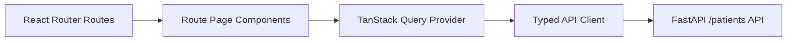

---

### 5. Responsive layout and patient directory

**Commit:** `feat(web): add responsive layout and patient list`

**What changed**

* Added the responsive header, sidebar, and main content shell.
* Replaced the patients placeholder with a backend-driven directory.
* Added URL-backed search, status filtering, sorting, page size, and pagination.
* Added non-blocking search input with deferred URL updates.
* Added loading, empty, error, and incremental fetching states for the directory.

**Why it mattered**

* Delivered the primary reviewer-visible workflow: finding and opening patient records.
* Kept search/filter/sort/pagination on the API boundary rather than duplicating it in browser state.
* Made the layout usable on desktop and lower-resolution screens before adding detail and form flows.

**Requirement coverage**

* Responsive layout with header, sidebar, and main area.
* Patient list showing name, age, last visit, and status.
* Search/filter functionality.
* Sorting.
* Pagination.
* Non-blocking search.
* Meaningful loading, empty, and error states.

**Verification**

* `cd frontend`
* `npm run lint`
* `npm run build`

**Current architecture impact**

The frontend now consumes the patient list endpoint as designed: URL params become typed API params, TanStack Query fetches the current page, and the UI renders list state without owning database-scale behavior.

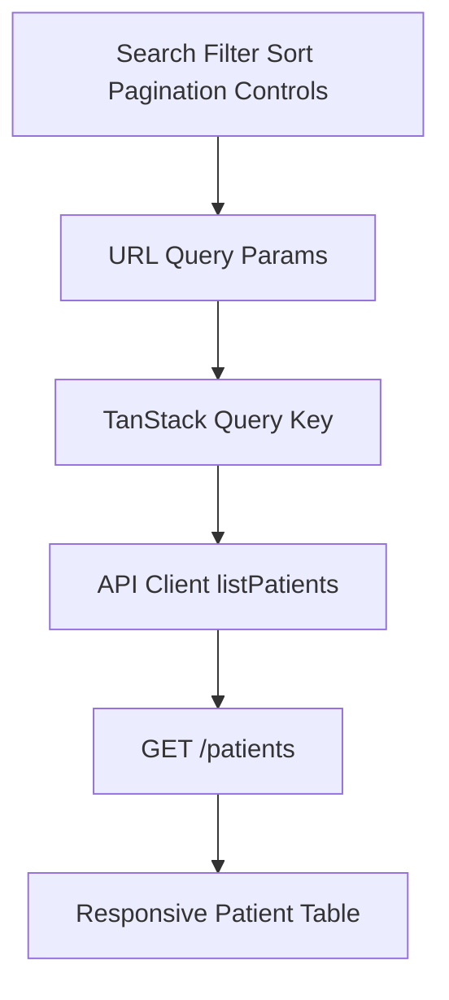

---

### 6. Patient detail view

**Commit:** `feat(web): add patient detail page`

**What changed**

* Added a data-backed `/patients/:id` page.
* Rendered patient demographics, contact details, status, last visit, conditions, and allergies.
* Added detail-specific loading, error, and not-found states.
* Added navigation back to the directory and forward to edit.

**Why it mattered**

* Completed the read side of the patient workflow after directory selection.
* Made the record view useful enough for notes and generated summaries to attach in the next milestone.
* Preserved a simple API boundary by reusing `GET /patients/{id}` through the typed client.

**Requirement coverage**

* Patient detail page.
* Meaningful loading, error, and not-found states.
* Responsive detail layout.

**Verification**

* `cd frontend`
* `npm run lint`
* `npm run build`

**Current architecture impact**

The frontend has a complete list-to-detail read path. Patient detail state is fetched independently by ID, which keeps the URL route refreshable and avoids relying on the previous directory page cache.

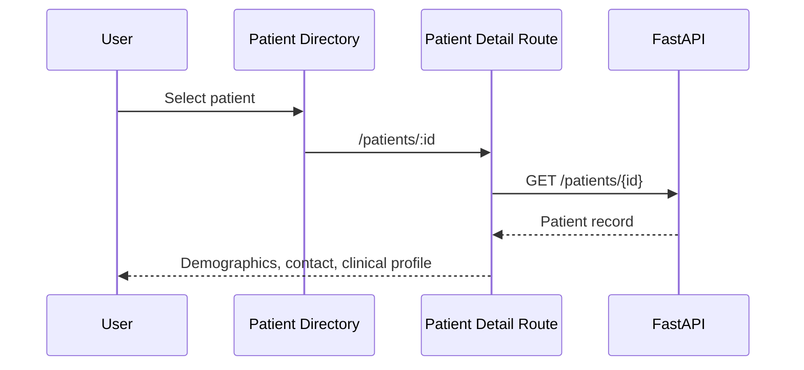

---

### 7. Patient notes and deterministic summaries

**Commit:** `feat(api,web): add patient notes and generated summaries`

**What changed**

* Added a `patient_notes` table related to patients.
* Added note create, list, and delete endpoints.
* Added `GET /patients/{id}/summary` with deterministic patient-and-note summary logic.
* Added backend tests for notes, validation, deletion cleanup, and summary output.
* Added summary and notes panels to the patient detail page.

**Why it mattered**

* Completed the clinical context workflow around a patient record without adding external services.
* Kept summaries explainable and locally runnable by deriving them from stored patient fields and notes.
* Gave reviewers an end-to-end example of child-resource API design and UI mutation handling.

**Requirement coverage**

* `POST /patients/{id}/notes`
* `GET /patients/{id}/notes`
* `DELETE /patients/{id}/notes/{note_id}`
* `GET /patients/{id}/summary`
* Notes UI.
* Generated summary UI.
* Server-side validation and useful not-found messages for notes.

**Verification**

* `cd backend`
* `source .venv/bin/activate 2>/dev/null || true`
* `python -m pytest -q`
* `python -m compileall -q app tests`
* `cd frontend`
* `npm run lint`
* `npm run build`

**Current architecture impact**

The patient record now has a child-resource workflow. Notes are persisted in the database, summaries are derived at request time, and the frontend invalidates notes and summary queries together after note mutations.

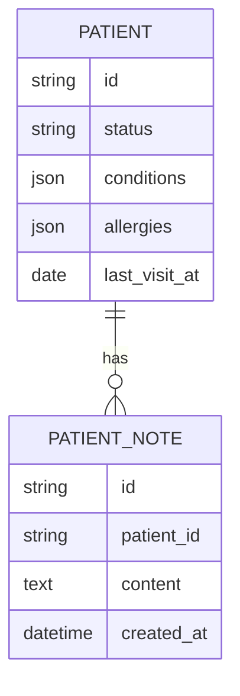

---

### 8. Patient create and edit forms

**Commit:** `feat(web): add patient create and edit forms`

**What changed**

* Replaced the form placeholder with create and edit workflows.
* Added client-side validation for required names, dates, email format, state codes, blood type, and future dates.
* Wired create and update mutations to the existing patient CRUD API.
* Added user-facing server/network error display and route-aware loading/error states for edit mode.
* Invalidated patient list and detail queries after saves.

**Why it mattered**

* Completed the full patient CRUD workflow from the browser.
* Kept validation layered: fast client checks first, backend validation still authoritative.
* Preserved the simple API contract by posting the same payload shape the backend already validates.

**Requirement coverage**

* `/patients/new`
* `/patients/:id/edit`
* Create/edit patient forms.
* Client-side and server-side validation.
* Network and validation error handling.

**Verification**

* `cd frontend`
* `npm run lint`
* `npm run build`

**Current architecture impact**

The frontend now supports all patient CRUD operations. Form state is local to the route, server state remains in TanStack Query, and successful mutations refresh the cached list/detail data before returning to the patient record.

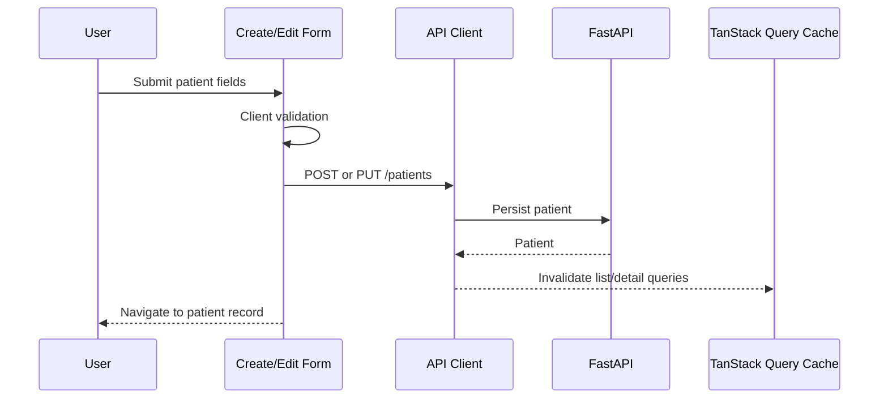

---

### 9. Docker Compose local setup

**Commit:** `chore(docker): add Docker Compose local setup`

**What changed**

* Added root `docker-compose.yml` with PostgreSQL, backend, and frontend services.
* Added backend and frontend Dockerfiles.
* Added Docker ignore files so virtualenvs, node modules, build output, caches, and local databases stay out of images.
* Added seed configuration values to `.env.example`.

**Why it mattered**

* Created the expected one-command local review path.
* Moved the app from separate local processes toward a reproducible full-stack setup.
* Kept PostgreSQL as the Docker-backed database while preserving SQLite for lightweight non-Docker backend tests.

**Requirement coverage**

* Working Compose definition for frontend, backend, and PostgreSQL.
* Backend Dockerfile.
* Frontend Dockerfile.
* PostgreSQL service.
* `.env.example` includes required runtime variables.

**Verification**

* `docker compose config` passed.
* `docker compose up --build` was attempted but Docker daemon was unavailable in this environment: `Cannot connect to the Docker daemon at unix:///Users/ngavelek/.docker/run/docker.sock. Is the docker daemon running?`
* `cd backend`
* `source .venv/bin/activate 2>/dev/null || true`
* `python -m pytest -q`
* `python -m compileall -q app tests`
* `cd frontend`
* `npm run lint`
* `npm run build`

**Current architecture impact**

The intended local runtime is now containerized as three services. Full runtime verification needs Docker Desktop or another Docker daemon running locally, then `docker compose up --build`.

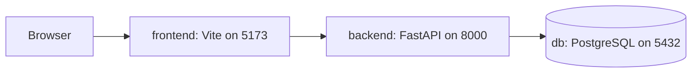

---

### 10. Reviewer README and tradeoffs

**Commit:** `docs: add README reviewer path and tradeoffs`

**What changed**

* Rewrote the README around the reviewer path.
* Documented Docker startup, local development, verification commands, implemented API endpoints, and architecture tradeoffs.
* Pointed reviewers to the architecture timeline for the implementation narrative.

**Why it mattered**

* Made the project easier to run and evaluate quickly.
* Captured the deliberate scope decisions: backend-owned list behavior, deterministic summaries, TanStack Query, and no out-of-scope infrastructure.
* Reduced interview risk by giving a concise explanation path.

**Requirement coverage**

* Succinct README with local setup instructions.
* Docker Compose reviewer command.
* Backend/frontend verification commands.
* Architecture and tradeoff documentation.

**Verification**

* `docker compose config`
* `cd backend`
* `source .venv/bin/activate 2>/dev/null || true`
* `python -m pytest -q`
* `python -m compileall -q app tests`
* `cd frontend`
* `npm run lint`
* `npm run build`

**Current architecture impact**

The implementation is now documented as a runnable, reviewable full-stack submission rather than a collection of source files.

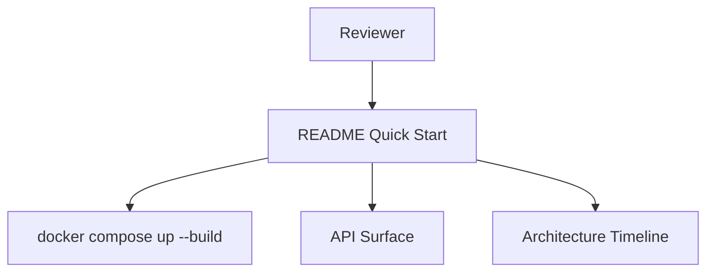

---

### 11. Patient form UX polish

**Commit:** `polish: clarify patient form status and medical inputs`

**What changed**

* Manual UX review found unclear patient form inputs.
* Clarified status, date, conditions, and allergy fields with human-readable labels and helper text.
* Added lightweight parsed-entry preview chips for comma-separated conditions and allergies.
* Moved the detail-page edit action next to the status badge so status changes are easier to discover.

**Why it mattered**

* Improved workflow usability without changing the backend data shape or core architecture.
* Made status changes, date entry, and medical-list entry easier to understand during manual testing.

**Requirement coverage**

* Create/edit patient form clarity.
* Patient detail edit discoverability.
* Existing validation and submission behavior preserved.

**Verification**

* `cd frontend && npm run build && npm run lint && cd ..`
* `cd backend && source .venv/bin/activate 2>/dev/null || true && python -m pytest -q && cd ..`
* `git status`
* `git diff --stat`

**Current architecture impact**

No architecture change. This is a presentation-layer polish pass over the existing patient CRUD workflow.

---

### 12. Patient directory as primary dashboard

**Commit:** `polish: make patient directory the primary dashboard`

**What changed**

* Manual UX review found the empty dashboard added friction before the useful workflow.
* `/` now routes directly to `/patients`.
* Removed the unused Dashboard navigation item and deleted the unused home page component.

**Why it mattered**

* The patient directory is treated as the primary operational dashboard.
* Reviewers and users now land directly on search, filtering, sorting, pagination, and patient record navigation.

**Requirement coverage**

* `/patients`, `/patients/:id`, `/patients/new`, `/patients/:id/edit`, and the 404 route remain intact.
* App branding remains `Ascertain Healthcare Dashboard`.

**Verification**

* `cd frontend && npm run build && npm run lint && cd ..`
* `cd backend && source .venv/bin/activate && python -m pytest -q && cd ..`

**Current architecture impact**

No backend or data model change. This is a routing/navigation polish pass that makes the patient directory the default operational surface.

---

### 13. Operational metrics and request logging

**Commit:** `feat: add operational metrics and request logging`

**What changed**

* Added a lightweight backend `GET /patients/stats` endpoint for total patients, status counts, and recent visits.
* Added compact metrics cards and a CSS-based status visualization above the patient list.
* Added FastAPI request logging middleware using standard Python logging.
* Request logs include only HTTP method, path, status code, and duration in milliseconds.

**Why it mattered**

* `/patients` now behaves more like the primary operational dashboard.
* Status metrics come from backend data instead of a single paginated list response.
* Metadata-only request logs improve observability without logging request bodies or patient data.

**Requirement coverage**

* Data visualization / operational metrics.
* Patient status visualization without adding a charting dependency.
* Basic backend observability middleware.
* Existing search/filter/sort/pagination remains owned by the current list endpoint.

**Verification**

* `cd backend && source .venv/bin/activate && python -m pytest -q && python -m compileall -q app tests && cd ..`
* `cd frontend && npm run build && npm run lint && cd ..`
* `docker compose config`

**Current architecture impact**

The frontend now consumes a second read-only backend endpoint for dashboard-level metrics while keeping the paginated list endpoint focused on directory rows.

```mermaid
flowchart LR
  PatientsPage[/patients page] --> Stats[GET /patients/stats]
  PatientsPage --> List[GET /patients?page=&status=&sort_by=]
  Stats --> Metrics[Cards and CSS status bar]
  List --> Table[Patient directory table]
```

---

### 14. Final hardening review

**Commit:** `polish: harden take-home before submission`

**What changed**

* Ran an adversarial security, backend, frontend, Docker, and documentation review.
* Tightened backend validation for server-side email format, required update fields, and medical list payload types.
* Added regression tests for invalid list parameters, invalid patient payloads, wrong-patient note deletion, and summaries without notes.
* Improved frontend mutation invalidation so patient stats and generated summaries refresh after patient saves.
* Added a preflight guard against tracked local/generated/secret-bearing files.

**Why it mattered**

* Reduced 500-risk validation paths before submission.
* Protected child-resource ownership semantics for patient notes.
* Kept dashboard metrics and summaries from going stale after create/edit workflows.
* Made final reviewer verification more explicit without adding out-of-scope infrastructure.

**Requirement coverage**

* Server-side validation and useful errors.
* Notes endpoint ownership guardrails.
* Patient create/edit cache correctness.
* Docker-backed preflight workflow.
* No request body, note content, or patient data logging.

**Verification**

* `make preflight`
* `git ls-files | grep -E "node_modules|\.venv|\.env$|dist|dev\.db|\.DS_Store" || true`

**Current architecture impact**

No new architectural component. This is a final guardrail pass over the existing FastAPI, React, TanStack Query, Docker Compose, and Makefile workflow.

---

## Backend Request Flow

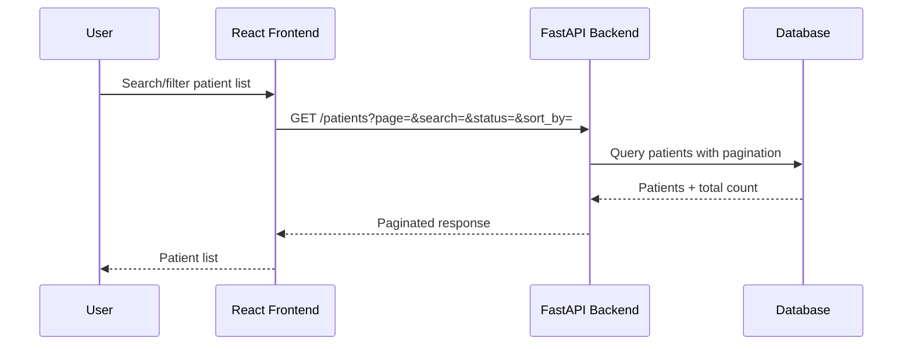

## Data Model

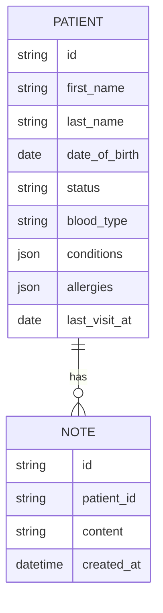

## Design Decisions To Maintain

### Backend-owned pagination/filtering/sorting

The backend should own list operations instead of loading all patients into the browser. This keeps the frontend responsive as the dataset grows and demonstrates a more scalable API boundary.

### Deterministic summary instead of external LLM

The summary endpoint should be locally runnable without API keys. A deterministic summary avoids nondeterminism, hallucination risk, latency, and external dependency failures.

### TanStack Query for server state

Most frontend state in this app is server state: patients, notes, summaries, loading, errors, and refetching. TanStack Query is a better fit than Redux for this scope.

### Synthetic data only

All patient data must be fake and synthetic. No real patient data should be used or committed.

## 90-Second Interview Explanation

I built this as a small but production-minded patient management dashboard. The backend is FastAPI with a patient model, seeded synthetic data, CRUD endpoints, notes, and deterministic summaries. The frontend is React TypeScript with route-based screens for the dashboard, patient list, patient detail, and create/edit flows. I kept pagination, filtering, and sorting on the backend because that is the right boundary if the dataset grows. I also added an architecture timeline so the reviewer can see how the project evolved commit by commit and so I can explain the tradeoffs clearly in the next round.

## 5-Minute Interview Explanation

Start with the backend foundation: FastAPI, `/health`, config, tests.

Then explain the data model: patient records first, notes second, summary derived from patient and note data.

Then explain the API boundary: the frontend does not own business validation or list-scale behavior. The backend validates inputs, returns useful errors, and owns pagination/filtering/sorting.

Then explain the frontend: React TypeScript, routing, TanStack Query for server state, responsive dashboard layout, patient list, detail, forms, notes, and summary.

Then explain Docker: Docker Compose makes the reviewer experience simple by launching frontend, backend, and PostgreSQL together.

Then explain tradeoffs: deterministic summaries instead of external LLMs, no auth because not required, no overbuilt workflows, and synthetic data only.
