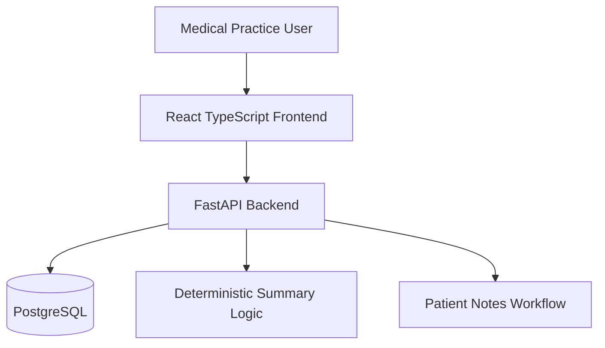
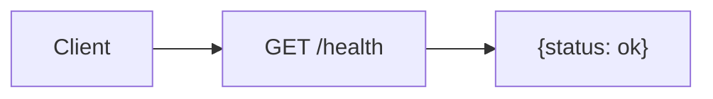
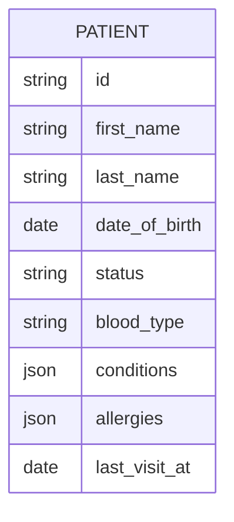
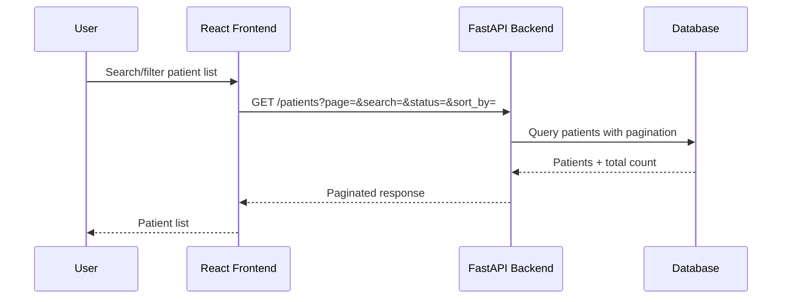
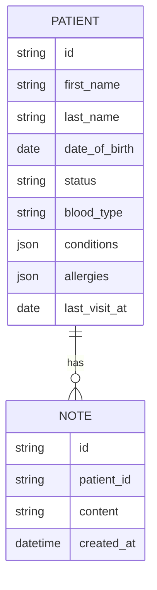

# ARCHITECTURE_TIMELINE.md

# Architecture Timeline

This document explains how the Ascertain healthcare dashboard evolved commit by commit. It is intended to be useful both for code review and for explaining the project in a follow-up engineering interview.

## Purpose

This project is a full-stack patient management dashboard for a medical practice. It is built with:

* React TypeScript frontend
* FastAPI backend
* PostgreSQL database through Docker Compose
* synthetic patient data
* deterministic patient summaries
* patient notes workflow

The project is built incrementally so each commit represents a working milestone.

## Current Architecture Snapshot

## Commit Timeline

### 1. FastAPI foundation

**Commit:** `feat(api): add FastAPI foundation, health check, settings, and tests`

**What changed**

* Added FastAPI application structure.
* Added app settings.
* Added `GET /health`.
* Added a backend health test.

**Why it mattered**

* Established the backend entrypoint.
* Verified the API can run and be tested.
* Satisfied the required health-check endpoint.

**Requirement coverage**

* FastAPI backend initialized.
* `GET /health` returns `{"status": "ok"}`.

**Verification**

* `pytest -q`

---

### 2. Patient database model and seed data

**Commit:** `feat(api): add patient database model and seed data`

**What changed**

* Added SQLAlchemy database setup.
* Added patient model.
* Added synthetic seed data.
* Added database seed tests.

**Why it mattered**

* Created the data foundation for the dashboard.
* Made the app capable of storing realistic patient records.
* Prepared the project for PostgreSQL in Docker.

**Requirement coverage**

* Patient schema.
* Realistic sample data.
* Re-creatable database foundation.

**Verification**

* `pytest -q`

---

## Backend Request Flow

## Data Model

## Design Decisions To Maintain

### Backend-owned pagination/filtering/sorting

The backend should own list operations instead of loading all patients into the browser. This keeps the frontend responsive as the dataset grows and demonstrates a more scalable API boundary.

### Deterministic summary instead of external LLM

The summary endpoint should be locally runnable without API keys. A deterministic summary avoids nondeterminism, hallucination risk, latency, and external dependency failures.

### TanStack Query for server state

Most frontend state in this app is server state: patients, notes, summaries, loading, errors, and refetching. TanStack Query is a better fit than Redux for this scope.

### Synthetic data only

All patient data must be fake and synthetic. No real patient data should be used or committed.

## 90-Second Interview Explanation

I built this as a small but production-minded patient management dashboard. The backend is FastAPI with a patient model, seeded synthetic data, CRUD endpoints, notes, and deterministic summaries. The frontend is React TypeScript with route-based screens for the dashboard, patient list, patient detail, and create/edit flows. I kept pagination, filtering, and sorting on the backend because that is the right boundary if the dataset grows. I also added an architecture timeline so the reviewer can see how the project evolved commit by commit and so I can explain the tradeoffs clearly in the next round.

## 5-Minute Interview Explanation

Start with the backend foundation: FastAPI, `/health`, config, tests.

Then explain the data model: patient records first, notes second, summary derived from patient and note data.

Then explain the API boundary: the frontend does not own business validation or list-scale behavior. The backend validates inputs, returns useful errors, and owns pagination/filtering/sorting.

Then explain the frontend: React TypeScript, routing, TanStack Query for server state, responsive dashboard layout, patient list, detail, forms, notes, and summary.

Then explain Docker: Docker Compose makes the reviewer experience simple by launching frontend, backend, and PostgreSQL together.

Then explain tradeoffs: deterministic summaries instead of external LLMs, no auth because not required, no overbuilt workflows, and synthetic data only.
